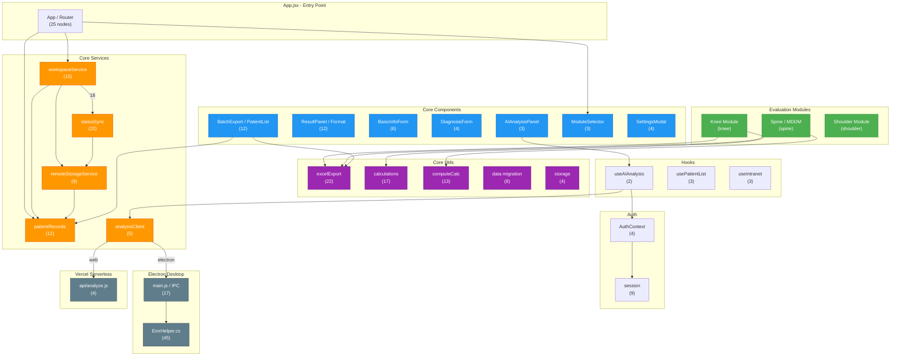

# Architecture Diagram

code-review-graph 기반 아키텍처 다이어그램 (407 nodes, 2852 edges, 49 communities)

## 범례
- **초록(module)**: 평가 모듈 (knee, spine, shoulder)
- **파랑(core)**: 공유 UI 컴포넌트
- **주황(svc)**: 서비스 레이어 (데이터 동기화, 스토리지)
- **보라(util)**: 유틸리티 (계산, 내보내기, 마이그레이션)
- **회색(infra)**: 인프라 (Electron IPC, Vercel API)

## Diagram

